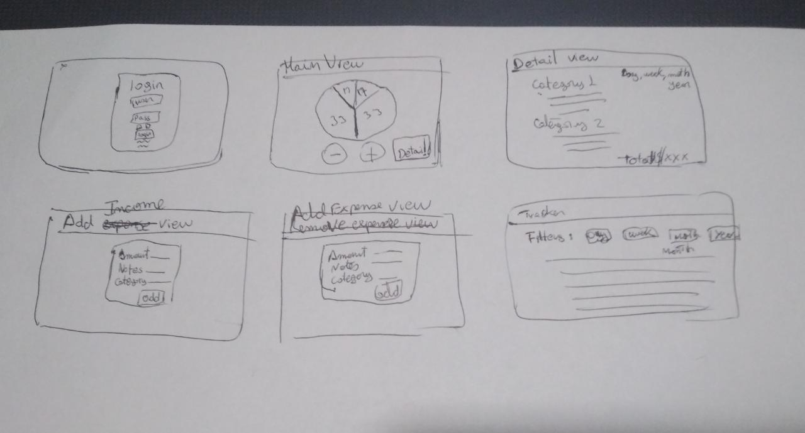
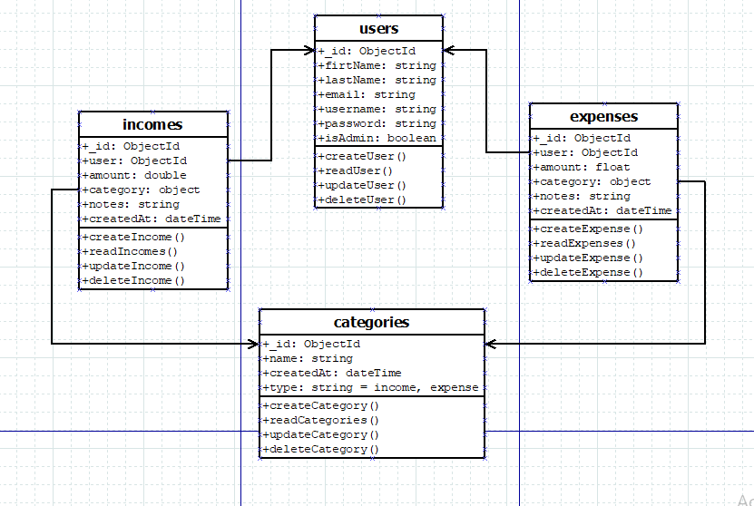
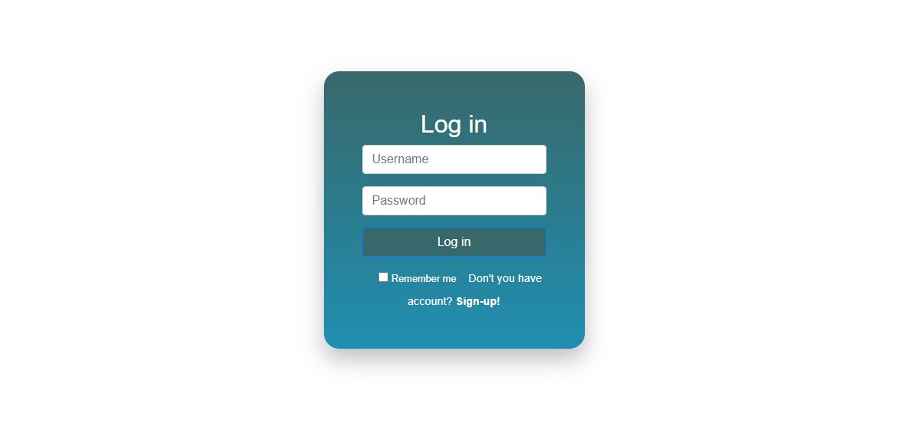
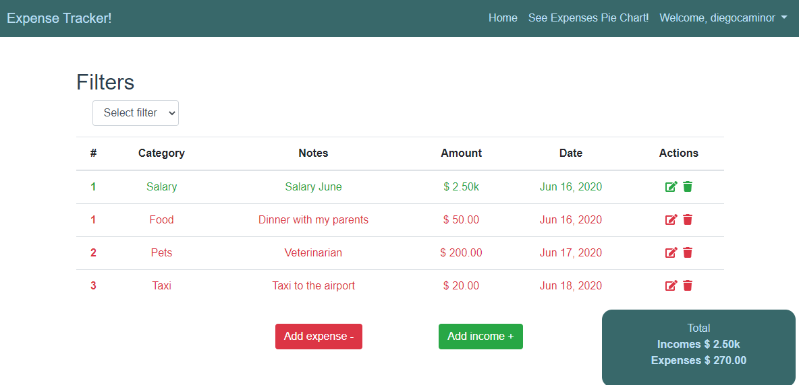
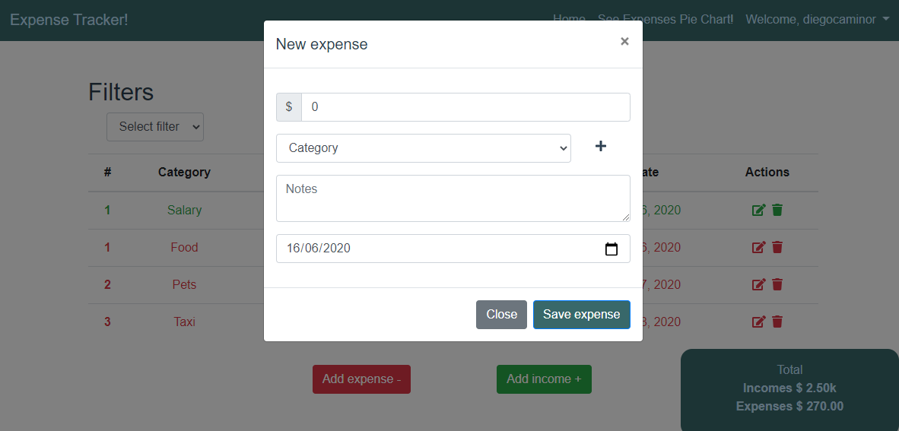
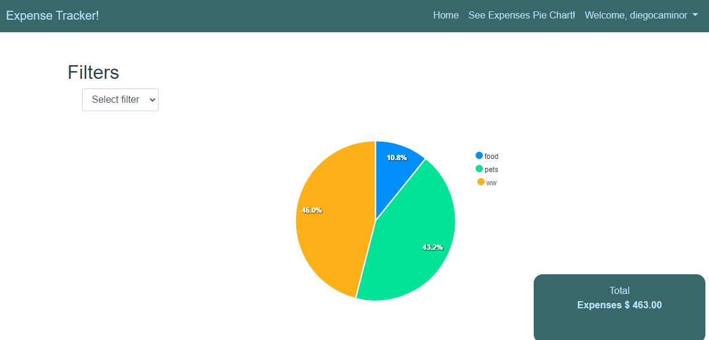

# :ledger: expense-tracker-client

Single page applicationthat works to keep track of your expenses using microservices-based architecture.

### 🛠️ Technologies

- [**Node**](https://nodejs.org/en/)
- [**Vuejs**](https://vuejs.org/)
- [**Fetch**](https://developer.mozilla.org/es/docs/Web/API/Fetch_API/Utilizando_Fetch)


### 📷 Screenshots








## Project setup
```
npm install
```

### Compiles and hot-reloads for development
```
npm run serve
```

### Compiles and minifies for production
```
npm run build
```

### Lints and fixes files
```
npm run lint
```

### Customize configuration
See [Configuration Reference](https://cli.vuejs.org/config/).
